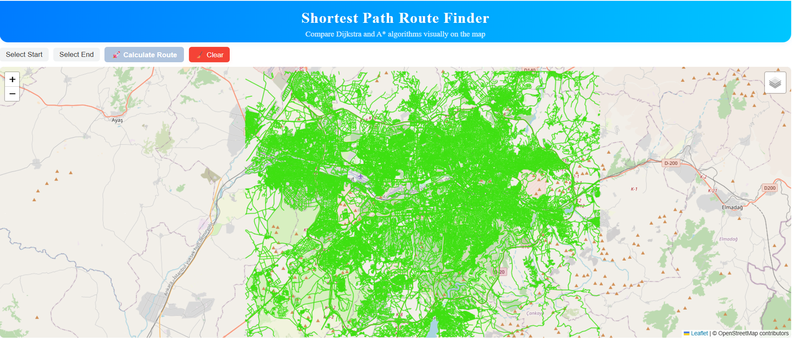

# Getting Started with Create React App
## Shortest Path MVP

This project is a simple MVP for visualizing and calculating the shortest route on a road network using React, Leaflet, GeoServer, and a Node.js backend.

### Features
- Interactive map with OpenStreetMap basemap
- Road network and shortest path layers from GeoServer (WMS)
- Select start and end points on the map
- Send selected points to backend for shortest path calculation
- Display results as a WMS layer

### Setup
1. **Backend**: Start the Node.js backend in `backend/` (see `index.js`).
2. **Frontend**: Start the React app in `frontend/` using `npm start`.
3. **GeoServer**: Make sure GeoServer is running and WMS layers (`network:grid_lines`, `network:mv_short_path`) are published.

### Usage
- Click "Select Start" and choose a start point on the map.
- Click "Select End" and choose an end point.
- Click "Send (Route Request)" to calculate and display the shortest path.

### Requirements
- Node.js, npm
- GeoServer with proper layers
- PostgreSQL/PostGIS for network data
- React and Leaflet for frontend mapping
- Express for backend API
### Notes
- Ensure CORS is handled properly between frontend and backend.
- Adjust GeoServer WMS URLs as needed for your setup.
- This is a basic MVP; further enhancements can include error handling, UI improvements, and additional features.
